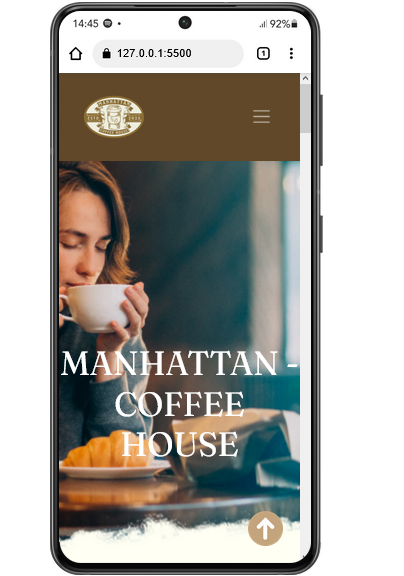
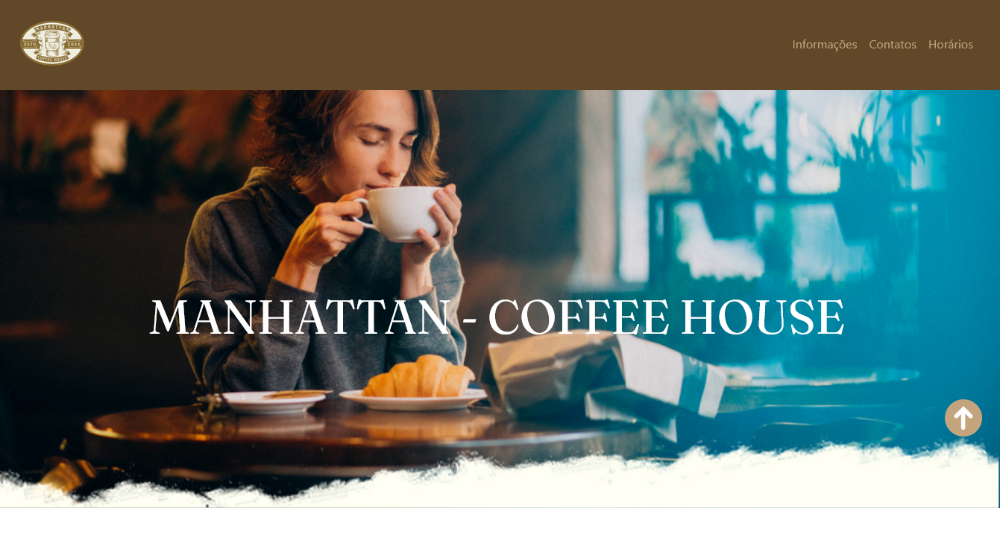

<h1>☕ Manhattan Coffee House </h1>

O Manhattan Coffee House é um site fictício desenvolvido para apresentar uma cafeteria sofisticada e acolhedora. O site destaca a experiência única proporcionada pelo café gourmet, com informações detalhadas sobre a história e os diferenciais do estabelecimento. O design elegante e responsivo garante uma navegação agradável tanto em dispositivos móveis quanto em desktops.

<div align="center">
  
  
  
</div>


## :floppy_disk:Recursos


 **Design Responsivo:** 
 Design Responsivo: Compatível com dispositivos móveis e desktops.
Menu Suspenso: Funcionalidade adaptada para dispositivos móveis.
Estilo Moderno: Construído com HTML, CSS e Bootstrap.


## :key: Instalação

Para configurar e executar este projeto localmente, siga as etapas abaixo:

1. Clone o repositório:
    ```bash
    git clone https://github.com/larialv12/cafeteria
    ```

2. Navegue até o diretório do projeto:
    ```bash
    cd cafeteria
    ```

3. Abra o arquivo `index.html` em seu navegador preferido.

## :dart: Uso

Abra o arquivo `index.html` em seu navegador para visualizar o site.

## :round_pushpin:Tecnologias Utilizadas

<div align="left">
  
  
  
  
  
  
  
</div>
